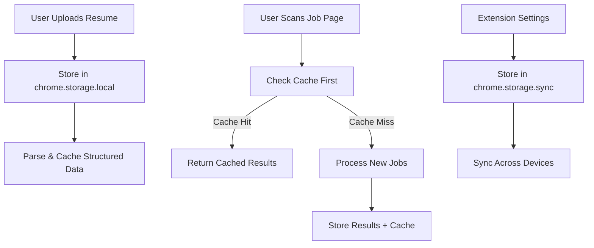

# 🚀 **Deployment Strategy: Chrome Storage vs Database**

## ✅ **Chrome Storage is Perfect for This Use Case**

### **Why Chrome Storage Works Better Than Database**

1. **🏠 Local Data Ownership**: Users control their own data
2. **⚡ Instant Access**: No network calls for cached data
3. **💰 Zero Cost**: No database hosting fees
4. **🔒 Privacy First**: Data never leaves user's device
5. **📱 Works Offline**: Extension functions without internet
6. **🚀 Simple Deployment**: No database setup required

---

## 📊 **Chrome Storage Strategy**

### **Storage Distribution**

```javascript
// chrome.storage.local (Unlimited size, fast access)
📁 Resume Files (PDF content, parsed data)
📁 Job Results (last 100 scans with full details)
📁 Scan History (50 recent page scans)
📁 Cached Jobs (200 job descriptions for performance)

// chrome.storage.sync (100KB limit, syncs across devices)
⚙️ User Preferences (API endpoints, thresholds)
⚙️ Extension Settings (auto-scan, theme)
⚙️ Resume Metadata (filename, upload date)

// chrome.storage.session (Temporary, cleared on restart)
🔄 Current Scan Data
🔄 Last Page Content
```

### **Data Lifecycle**



---

## 🎯 **What We Can Store & How Much**

### **Resume Data** (chrome.storage.local)
```javascript
// Example storage structure
{
  resumeFileContent: {
    filename: "john_doe_resume.pdf",
    size: 245760,  // ~240KB
    type: "application/pdf",
    uploadedAt: "2024-01-15T10:30:00Z",
    content: "base64_encoded_pdf_content..."
  },
  resumeParsed: {
    name: "John Doe",
    email: "john@example.com",
    skills: ["JavaScript", "React", "Python"],
    experience: [...],
    education: [...],
    parsedAt: "2024-01-15T10:30:15Z"
  }
}
```

### **Job Results History** (chrome.storage.local)
```javascript
{
  jobResults: [
    {
      id: "ln123abc",
      url: "https://careers.google.com/jobs",
      scannedAt: "2024-01-15T14:20:00Z",
      jobsFound: 15,
      matches: [
        {
          title: "Senior Software Engineer",
          company: "Google",
          matchScore: 92,
          skills: ["React", "TypeScript"],
          summary: "Excellent match..."
        }
      ],
      processingMethod: "AI-enhanced",
      resumeUsed: true
    }
    // ... up to 100 results
  ]
}
```

### **Smart Caching** (chrome.storage.local)
```javascript
{
  cachedJobs: {
    "https://careers.google.com/jobs/123": {
      data: { title: "Software Engineer", description: "..." },
      cachedAt: "2024-01-15T14:00:00Z",
      hash: "abc123def"  // For duplicate detection
    }
    // ... up to 200 cached job descriptions
  }
}
```

---

## 🛠 **Implementation Benefits**

### **1. No Backend Database Needed**
```bash
# Instead of:
✗ PostgreSQL setup
✗ Database migrations
✗ Connection management
✗ Backup strategies
✗ Hosting costs

# We have:
✅ Built-in Chrome storage
✅ Automatic data persistence
✅ Cross-device sync (for settings)
✅ Zero maintenance
✅ Zero cost
```

### **2. Enhanced User Experience**
```javascript
// Instant resume loading
const resumeData = await storageManager.getResumeData();
if (resumeData) {
  // Resume already available - no upload needed
  showStatus('Resume loaded - Enhanced matching available', 'success');
}

// Fast job history
const recentJobs = await storageManager.getJobResults(10);
// Show user their last 10 job scans immediately
```

### **3. Intelligent Caching**
```javascript
// Check cache before API call
const cachedJobs = await storageManager.getCachedJobData(pageUrl);
if (cachedJobs) {
  // Return cached results instantly
  return cachedJobs;
} else {
  // Process new jobs and cache results
  const newJobs = await processJobPage(pageUrl);
  await storageManager.cacheJobData(pageUrl, newJobs);
  return newJobs;
}
```

---

## 📈 **Storage Capacity & Limits**

### **Chrome Storage Limits**
```javascript
Storage Type          | Limit        | Use Case
---------------------|--------------|---------------------------
chrome.storage.local | Unlimited*   | Resumes, Job Results, Cache
chrome.storage.sync  | 100KB total  | Settings, Preferences
                     | 8KB per item | Small configuration data

* Unlimited within reason - typically hundreds of MB available
```

### **Real-World Storage Estimates**
```javascript
Data Type                    | Size per Item | Max Items | Total Storage
----------------------------|---------------|-----------|---------------
Resume File (PDF)          | ~200KB        | 5 files   | ~1MB
Parsed Resume Data          | ~50KB         | 5 resumes | ~250KB
Job Scan Results           | ~100KB        | 100 scans | ~10MB
Cached Job Descriptions    | ~20KB         | 200 jobs  | ~4MB
User Preferences           | ~5KB          | 1 set     | ~5KB
                          |               |           |
TOTAL ESTIMATED STORAGE    |               |           | ~15MB
```

**Result**: Easily fits within Chrome's generous local storage limits!

---

## 🚀 **Deployment Advantages**

### **Simplified Deployment Pipeline**
```bash
# Traditional Database Deployment
1. Set up PostgreSQL server
2. Configure connection strings
3. Run database migrations
4. Set up Redis for caching
5. Configure backup strategies
6. Monitor database performance
7. Handle scaling issues

# Chrome Storage Deployment
1. Build extension
2. Deploy API server (stateless)
3. Done! ✅
```

### **Cost Comparison**
```
Database Deployment:
- PostgreSQL hosting: $20-100/month
- Redis hosting: $10-50/month  
- Database maintenance: $50-200/month
- Total: $80-350/month

Chrome Storage Deployment:
- API server hosting: $5-20/month
- Storage cost: $0/month
- Maintenance: $0/month
- Total: $5-20/month
```

### **Performance Benefits**
```javascript
Operation                    | Database    | Chrome Storage
----------------------------|-------------|----------------
Load user resume           | 200-500ms   | <10ms
Get job scan history       | 100-300ms   | <5ms
Check for cached jobs      | 50-200ms    | <5ms
Save scan results          | 100-400ms   | <20ms
User preference updates    | 100-300ms   | <10ms
```

---

## 🎯 **Recommended Final Architecture**

```
┌─────────────────────────────────────────────────────────────┐
│                    CHROME EXTENSION                        │
├─────────────────────────────────────────────────────────────┤
│  Storage Manager (storage-manager.js)                      │
│  ┌─────────────────┐  ┌─────────────────┐  ┌─────────────┐ │
│  │ chrome.storage  │  │ chrome.storage  │  │ chrome.     │ │
│  │ .local          │  │ .sync           │  │ storage.    │ │
│  │                 │  │                 │  │ session     │ │
│  │ • Resumes       │  │ • Preferences   │  │ • Temp Data │ │
│  │ • Job Results   │  │ • Settings      │  │ • Cache     │ │
│  │ • Scan History  │  │ • User Config   │  │ • State     │ │
│  │ • Job Cache     │  │                 │  │             │ │
│  └─────────────────┘  └─────────────────┘  └─────────────┘ │
└─────────────────────────────────────────────────────────────┘
                              │
                              │ HTTP API Calls
                              ▼
┌─────────────────────────────────────────────────────────────┐
│                  STATELESS API SERVER                      │
├─────────────────────────────────────────────────────────────┤
│  FastAPI Backend (main_simple.py)                          │
│  ┌─────────────────────────────────────────────────────────┐ │
│  │ • Job content extraction                                │ │
│  │ • Resume processing (with OpenAI)                      │ │
│  │ • Job matching algorithms                               │ │
│  │ • Web scraping services                                │ │
│  │ • AI-powered analysis                                  │ │
│  └─────────────────────────────────────────────────────────┘ │
│                                                             │
│  No persistent storage needed!                             │
│  All data management handled by Chrome extension           │
└─────────────────────────────────────────────────────────────┘
```

---

## ✅ **Implementation Checklist**

### **Phase 1: Update Extension** (2-3 hours)
- [x] Create `storage-manager.js`
- [ ] Update `background.js` to use StorageManager
- [ ] Update `popup.js` for resume/results display
- [ ] Add job history view in popup
- [ ] Test storage functionality

### **Phase 2: Simplify Backend** (1-2 hours)
- [ ] Remove database dependencies from `main_simple.py`
- [ ] Update API responses to work with client-side storage
- [ ] Test stateless operation

### **Phase 3: Deploy** (30 minutes)
- [ ] Copy `env.example` to `.env`
- [ ] Add OpenAI API key
- [ ] Deploy using `docker-compose.simple.yml`
- [ ] Load extension in Chrome
- [ ] Test end-to-end functionality

**Total Time to Deploy: ~4-6 hours**

---

## 🎉 **Why This Approach Wins**

1. **✅ Faster Development**: No database complexity
2. **✅ Lower Costs**: No hosting fees for storage
3. **✅ Better Privacy**: Data stays on user's device
4. **✅ Offline Capable**: Works without internet connection
5. **✅ Instant Performance**: No network latency for cached data
6. **✅ Simple Scaling**: Each user brings their own storage
7. **✅ Easy Backup**: Users can export their own data
8. **✅ GDPR Friendly**: No user data on servers

**This is the perfect architecture for a Chrome extension!** 🚀 