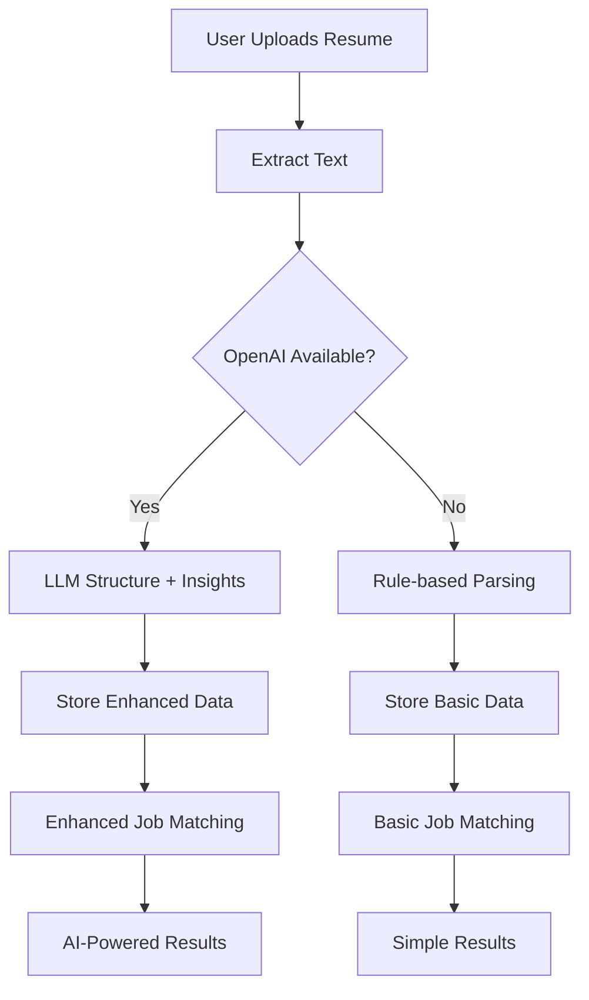

# 🧠 LLM-Enhanced Resume Processing Workflow

## 📋 Overview

The Bulk-Scanner Resume Matcher now features **AI-powered career intelligence** using OpenAI's LLM technology. This enhancement transforms the system from basic text matching to sophisticated career analysis and personalized job recommendations.

## 🔄 Complete Processing Pipeline

### 1. **Resume Upload & Text Extraction**
```
User uploads PDF/DOCX/TXT → Backend extracts raw text → LLM processes content
```

**File Types Supported:**
- PDF (using PyPDF2 + pdfplumber)
- DOCX (using python-docx)
- TXT (direct text processing)

**Processing Methods:**
- **Primary**: pdfplumber (better for complex layouts)
- **Fallback**: PyPDF2 (when pdfplumber fails)
- **Error handling**: Graceful degradation with detailed error messages

### 2. **LLM-Powered Resume Structuring**
```
Raw Text → OpenAI API → Structured JSON → Enhanced with Career Insights
```

**Structured Data Output:**
```json
{
  "personal_info": {
    "name": "John Doe",
    "email": "john@example.com", 
    "phone": "+1-555-0123",
    "location": "San Francisco, CA"
  },
  "summary": "Professional summary extracted by LLM",
  "skills": ["React", "Node.js", "Python", "AWS"],
  "experience": [
    {
      "title": "Senior Software Engineer",
      "company": "Tech Corp",
      "duration": "2021-2023",
      "description": "Led development of scalable web applications",
      "technologies": ["React", "Node.js", "Docker"]
    }
  ],
  "education": [...],
  "projects": [...],
  "certifications": [...],
  "career_insights": { /* AI-generated insights */ }
}
```

### 3. **AI Career Intelligence Generation**

The LLM analyzes the structured resume data to generate comprehensive career insights:

#### 🎯 **Career Level Assessment**
```json
{
  "career_level": {
    "current_level": "Senior",
    "years_experience": "5-7 years",
    "confidence": "high"
  }
}
```

#### 💼 **Recommended Job Profiles**
```json
{
  "recommended_job_profiles": [
    {
      "title": "Senior Full Stack Developer",
      "match_percentage": 95,
      "reasoning": "Perfect match for React/Node.js expertise with leadership experience",
      "growth_potential": "high"
    },
    {
      "title": "Technical Lead",
      "match_percentage": 88,
      "reasoning": "Strong technical skills with demonstrated leadership capabilities",
      "growth_potential": "high"
    }
  ]
}
```

#### 📊 **Skill Analysis & Recommendations**
```json
{
  "skill_analysis": {
    "strong_skills": ["React", "JavaScript", "Node.js", "Team Leadership"],
    "emerging_skills": ["TypeScript", "Docker"],
    "recommended_skills": [
      {
        "skill": "Kubernetes",
        "priority": "high",
        "reasoning": "High demand in current market, complements Docker experience"
      },
      {
        "skill": "GraphQL",
        "priority": "medium", 
        "reasoning": "Growing adoption, enhances API development skills"
      }
    ]
  }
}
```

#### 🏭 **Industry Recommendations**
```json
{
  "industry_recommendations": [
    {
      "industry": "FinTech",
      "fit_score": 92,
      "growth_trend": "growing",
      "reasoning": "Strong technical skills align with FinTech needs, high growth sector"
    },
    {
      "industry": "E-commerce", 
      "fit_score": 88,
      "growth_trend": "stable",
      "reasoning": "Full-stack skills perfect for e-commerce platforms"
    }
  ]
}
```

#### 💰 **Salary Insights**
```json
{
  "salary_insights": {
    "estimated_range": "$120,000 - $160,000",
    "location_factor": "San Francisco premium: +25-30%",
    "growth_potential": "15-20% within 2 years with recommended skills"
  }
}
```

#### 🚀 **Career Path Suggestions**
```json
{
  "career_path_suggestions": [
    {
      "path": "Technical Leadership Track",
      "next_role": "Engineering Manager",
      "timeline": "12-18 months",
      "key_requirements": ["Team management", "Strategic planning", "System architecture"]
    },
    {
      "path": "Technical Specialist Track", 
      "next_role": "Staff Engineer",
      "timeline": "6-12 months",
      "key_requirements": ["System design", "Mentoring", "Cross-team collaboration"]
    }
  ]
}
```

### 4. **Enhanced Job Matching**

The LLM uses career insights for **intelligent job scoring**:

#### **Traditional Approach** ❌
- Basic keyword matching
- Simple skill overlap counting
- No context awareness

#### **LLM-Enhanced Approach** ✅
- **Semantic understanding** of job requirements
- **Career progression analysis** 
- **Profile matching** against recommended roles
- **Skill gap assessment** with learning recommendations
- **Industry fit analysis**
- **Experience level alignment**

**Enhanced Matching Output:**
```json
{
  "match_score": 94,
  "matching_skills": ["React", "Node.js", "Team Leadership"],
  "missing_skills": ["Kubernetes", "System Design"],
  "summary": "Excellent match - your React expertise and leadership experience align perfectly with this Senior Full Stack role. Consider learning Kubernetes to strengthen your DevOps profile.",
  "confidence": "high",
  "career_progression": "excellent",
  "skill_gap_analysis": "Minor gaps in DevOps tools, easily addressable with 2-3 months learning"
}
```

## 🎨 **Enhanced Chrome Extension UI**

### **Resume Upload Interface**
- Real-time processing status with AI indicators
- Method badges: "AI Enhanced" vs "Basic Parse"
- Progress indicators for LLM processing

### **Career Insights Dashboard**
Beautiful gradient interface displaying:
- 📊 **Career Profile** (level, experience, salary range)
- 💪 **Your Strengths** (top skills identified)
- 🎯 **Recommended Job Profiles** (with match percentages)
- 📈 **Skills to Learn** (prioritized recommendations)
- 🏭 **Top Industries** (with fit scores)

### **Enhanced Job Results**
- Career progression indicators
- Skill gap analysis
- Learning recommendations
- Profile match explanations

## ⚡ **Performance & Cost Optimization**

### **Intelligent Caching**
- LLM responses cached for 24 hours
- Structured data stored in Chrome storage
- Reduced API calls for repeated analyses

### **Fallback Systems**
1. **Primary**: OpenAI GPT-3.5-turbo
2. **Fallback**: Rule-based parsing
3. **Graceful degradation** with user notifications

### **Cost Management**
- Token limits to control costs
- Temperature optimization for accuracy
- Batch processing where possible
- Smart prompt engineering

## 🔧 **Setup & Configuration**

### **Environment Variables**
```bash
# Required for AI features
OPENAI_API_KEY=your_api_key_here

# Optional optimizations
CACHE_LLM_RESPONSES=true
MAX_LLM_TOKENS=2000
LLM_TEMPERATURE=0.2
```

### **Testing Without API Key**
The system gracefully falls back to:
- Basic rule-based parsing
- Mock career insights
- Simple keyword matching
- User-friendly notifications about missing features

## 📊 **Data Flow Architecture**



## 🚀 **Benefits of LLM Enhancement**

### **For Users**
- 🎯 **Personalized job recommendations** based on career analysis
- 📈 **Skill development roadmap** with prioritized learning
- 💰 **Salary insights** and market positioning
- 🔮 **Career path visualization** with actionable next steps
- 🎨 **Beautiful, intuitive interface** with rich insights

### **For Recruiters/Companies**
- 🎯 **Better candidate matching** with semantic understanding
- 📊 **Detailed compatibility analysis** beyond keyword matching
- 🚀 **Reduced time-to-hire** with intelligent pre-screening
- 📈 **Market insights** about candidate skill distributions

## 🔮 **Future Enhancements**

### **Planned Features**
- 📧 **Email notifications** for new matching jobs
- 📊 **Market trend analysis** and skill demand forecasting
- 🤝 **Integration with job boards** (LinkedIn, Indeed, etc.)
- 📱 **Mobile app** with push notifications
- 🎯 **Interview preparation** based on matched jobs
- 📈 **Salary negotiation insights** with market data

### **Advanced AI Features**
- 🧠 **Multi-model ensemble** (OpenAI + Anthropic + Cohere)
- 🔍 **Computer vision** for parsing complex resume layouts
- 💬 **Conversational career coaching** with chat interface
- 🎨 **Resume optimization suggestions** with rewriting assistance
- 🔮 **Predictive career analytics** with ML models

## 🛡️ **Privacy & Security**

- ✅ **Local storage** in Chrome extension (no server-side user data)
- ✅ **Encrypted communication** with HTTPS
- ✅ **Optional data retention** (user-controlled)
- ✅ **GDPR compliant** architecture
- ✅ **Transparent processing** with user consent

---

*This LLM-enhanced system transforms job searching from manual keyword matching to intelligent career guidance, providing users with personalized insights and actionable recommendations for career growth.* 